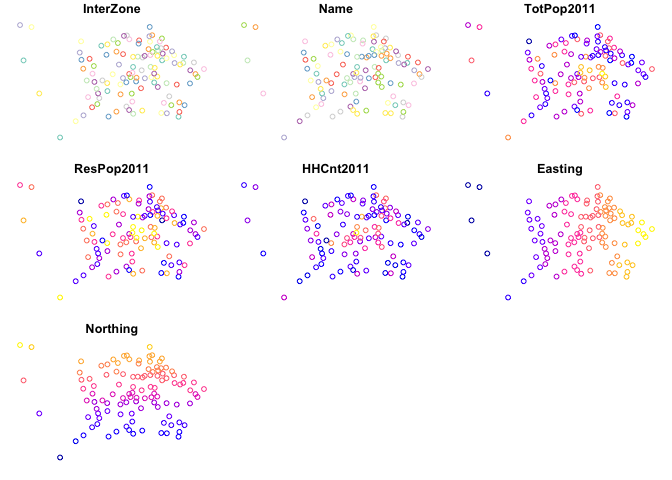

<!-- README.md is generated from README.Rmd. Please edit that file -->

# Origin-destination Jittering: Methods for Generating Desire Lines for Realistic Route Networks

<!-- badges: start -->

<!-- badges: end -->

Origin-destination (OD) datasets are ubiquitous for representing travel
behavior in transport planning and modelling. Despite emerging large
data sources, OD data continues to play an established — if not central
— role in transport research in the 21st century, with recent
applications ranging from analysis of the evolution of urban activity
and shared mobility services over time (e.g. Shi et al. 2019; Li et al.
2019) to inference of congestion and mode split (Bachir et al. 2019; Gao
et al. 2021). Perhaps in part because they are so well established,
there has been little research in recent years on new methods for
processing OD datasets to add value and insight, notwithstanding notable
exceptions for OD dataset validation (Alexander et al. 2015),
aggregation (He et al. 2018; Liu et al. 2021) and disaggregation
(Katranji et al. 2016).

Before consist of records that report at least three things:

-   A point of

# Research question and hypothesis

# Methods and data

## A synthetic example: synthetic zones

## Real world example: Edinburgh

    #>   geo_code1 geo_code2 all from_home train bus car_driver car_passenger bicycle
    #> 1 S02001576 S02001576 151         0     0   6         61             7       5
    #> 2 S02001576 S02001577 132         0     0  11         84            10      11
    #> 3 S02001576 S02001578  40         0     0   5         32             2       0
    #> 4 S02001576 S02001579  17         0     0   4         13             0       0
    #> 5 S02001576 S02001580   2         0     0   0          2             0       0
    #> 6 S02001576 S02001581  11         0     1   2          8             0       0
    #>   foot other
    #> 1   70     2
    #> 2   15     1
    #> 3    1     0
    #> 4    0     0
    #> 5    0     0
    #> 6    0     0
    #>   geo_code1 geo_code2 all from_home train bus car_driver car_passenger bicycle
    #> 1 S02001576 S02001576 151         0     0   6         61             7       5
    #> 2 S02001576 S02001577 132         0     0  11         84            10      11
    #> 3 S02001576 S02001578  40         0     0   5         32             2       0
    #> 4 S02001576 S02001579  17         0     0   4         13             0       0
    #> 5 S02001576 S02001580   2         0     0   0          2             0       0
    #> 6 S02001576 S02001581  11         0     1   2          8             0       0
    #>   foot other
    #> 1   70     2
    #> 2   15     1
    #> 3    1     0
    #> 4    0     0
    #> 5    0     0
    #> 6    0     0
    #> Simple feature collection with 6 features and 7 fields
    #> Geometry type: POINT
    #> Dimension:     XY
    #> Bounding box:  xmin: -3.342444 ymin: 55.88086 xmax: -3.246474 ymax: 55.90971
    #> Geodetic CRS:  WGS 84
    #>   InterZone                           Name TotPop2011 ResPop2011 HHCnt2011
    #> 1 S02001576 Balerno and Bonnington Village       5796       5771      2365
    #> 2 S02001577                    Currie West       4782       3272      1386
    #> 3 S02001578                    Currie East       3050       3050      1273
    #> 4 S02001579     Baberton and Juniper Green       3954       3918      1694
    #> 5 S02001580       Bonaly and The Pentlands       4295       4273      1767
    #> 6 S02001581        Colinton and Kingsknowe       4112       3743      1587
    #>   Easting Northing                   geometry
    #> 1  316116   666116 POINT (-3.342444 55.88086)
    #> 2  317812   667813 POINT (-3.315858 55.89639)
    #> 3  318655   668420 POINT (-3.302564 55.90199)
    #> 4  319584   669262 POINT (-3.287961 55.90971)
    #> 5  321320   668240 POINT (-3.259901 55.90082)
    #> 6  322169   668751 POINT (-3.246474 55.90554)

<!-- -->

# Findings

We found that re-sampling origin and start points during the conversion
of tabular OD datasets to their representation as geographic ‘desire
lines’ can be undertaken in a variety of ways, including simple random
sampling, sampling nodes on transport networks and simulating origin and
destination points in polygons representing building. Building on the
established practice of jittering in data visualisation (**ref?**), we
label this group of techniques ‘origin-destination jittering.’

We found that OD jittering led to substantially more dense and realistic
route networks.

# References

Alexander, Lauren, Shan Jiang, Mikel Murga, and Marta C Gonz. 2015.
“Validation of Origin-Destination Trips by Purpose and Time of Day
Inferred from Mobile Phone Data.” *Transportation Research Part B:
Methodological*, 1–20. <https://doi.org/10.1016/j.trc.2015.02.018>.

Bachir, Danya, Ghazaleh Khodabandelou, Vincent Gauthier, Mounim El
Yacoubi, and Jakob Puchinger. 2019. “Inferring Dynamic
Origin-Destination Flows by Transport Mode Using Mobile Phone Data.”
*Transportation Research Part C: Emerging Technologies* 101: 254–75.

Gao, Hong, Zhenjun Yan, Xu Hu, Zhaoyuan Yu, Wen Luo, Linwang Yuan, and
Jiyi Zhang. 2021. “A Method for Exploring and Analyzing Spatiotemporal
Patterns of Traffic Congestion in Expressway Networks Based on
Origin–Destination Data.” *ISPRS International Journal of
Geo-Information* 10 (5): 288.

He, Biao, Yan Zhang, Yu Chen, and Zhihui Gu. 2018. “A Simple Line
Clustering Method for Spatial Analysis with Origin-Destination Data and
Its Application to Bike-Sharing Movement Data.” *ISPRS International
Journal of Geo-Information* 7 (6): 203.
<https://doi.org/10.3390/ijgi7060203>.

Katranji, Mehdi, Etienne Thuillier, Sami Kraiem, Laurent Moalic, and
Fouad Hadj Selem. 2016. “Mobility Data Disaggregation: A Transfer
Learning Approach.” In *2016 IEEE 19th International Conference on
Intelligent Transportation Systems (ITSC)*, 1672–77.
<https://doi.org/10.1109/ITSC.2016.7795783>.

Li, Haojie, Yingheng Zhang, Hongliang Ding, and Gang Ren. 2019. “Effects
of Dockless Bike-Sharing Systems on the Usage of the London Cycle Hire.”
*Transportation Research Part A: Policy and Practice* 130 (December):
398–411. <https://doi.org/10.1016/j.tra.2019.09.050>.

Liu, Qiliang, Jie Yang, Min Deng, Ci Song, and Wenkai Liu. 2021.
“SNN\_flow: A Shared Nearest-Neighbor-Based Clustering Method for
Inhomogeneous Origin-Destination Flows.” *International Journal of
Geographical Information Science*, 1–27.

Shi, Xiaoying, Fanshun Lv, Dewen Seng, Baixi Xing, and Jing Chen. 2019.
“Exploring the Evolutionary Patterns of Urban Activity Areas Based on
Origin-Destination Data.” *IEEE Access* 7: 20416–31.

