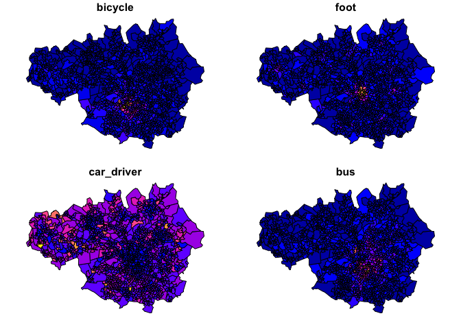

Open source software for reproducible transport data analysis: from
zones to route networks
================

<!-- README.md is generated from README.Rmd. Please edit that file -->
<!-- badges: start -->

[](https://github.com/Robinlovelace/odjitter/actions/workflows/render-rmarkdown.yaml)
<!-- badges: end -->

# Introduction

This repo was created to support at Open Data Manchester’s event on open
transport data, but it should be useful beyond that event, for anyone
wanting to get, analyse and model transport data with open source
software for transparent and evidence-based decision-making.

The amount of open data on transport systems can be overwhelming,
especially when much of it is hard to download, let alone visualise and
model and edit. In this talk I will talk about tools that can help with
accessing open transport data to support you to generate new evidence
and analysis in support of positive changes on vital travel networks in
Chorlton and beyond. I will show how to download and work with data on
road networks, road traffic casualties, and travel behaviour in R, a
statistical programming language with outstanding visualisation,
geographic analysis and statistical modelling capabilities. No need to
‘live code’ during the session: all the scripts to reproduce the outputs
from the presentations will be provided in the open to support
collaborative transport planning research.

# Set-up

To reproduce the code in this repo you will need to have R installed
and, most likely, an IDE for R such as RStudio (recommended unless you
already have a favourite coding tool that has good support for R such as
VSCode). You will also need to install some packages, e.g. by entering
the following commands into the R console:

``` r
pkgs = c(
  "pct",
  "stats19",
  "osmextract"
)
```

You can install these packages as follows:

``` r
install.packages(pkgs)
```

We will load the packages as we use them.

# Zone data from the PCT

``` r
head(pct::pct_regions$region_name)
#> [1] "london"                "greater-manchester"    "liverpool-city-region"
#> [4] "south-yorkshire"       "north-east"            "west-midlands"
zones = pct::get_pct_zones("greater-manchester")
names(zones)[1:20]
#>  [1] "geo_code"      "geo_name"      "lad11cd"       "lad_name"     
#>  [5] "all"           "bicycle"       "foot"          "car_driver"   
#>  [9] "car_passenger" "motorbike"     "train_tube"    "bus"          
#> [13] "taxi_other"    "govtarget_slc" "govtarget_sic" "govtarget_slw"
#> [17] "govtarget_siw" "govtarget_sld" "govtarget_sid" "govtarget_slp"
names_to_plot = c("bicycle", "foot", "car_driver", "bus")
plot(zones[names_to_plot] )
```

<!-- -->

# Desire line data from the PCT

# Crash data from stats19

# Transport infrastructure data from osmextra

# Scenarios of change

# Preparing data for A/B Street

# References
