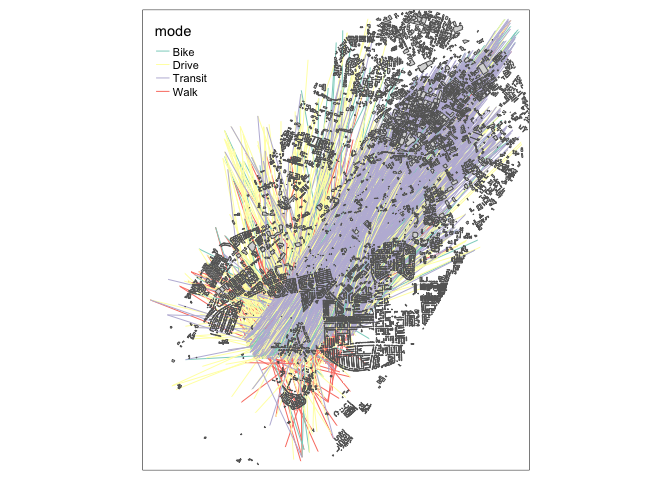

Open source software for reproducible transport data analysis: from
zones to route networks
================

<!-- README.md is generated from README.Rmd. Please edit that file -->
<!-- badges: start -->

[](https://github.com/Robinlovelace/odjitter/actions/workflows/render-rmarkdown.yaml)
<!-- badges: end -->

# Introduction

This repo was created to support at Open Data Manchester’s event on open
transport data, but it should be useful beyond that event, for anyone
wanting to get, analyse and model transport data with open source
software for transparent and evidence-based decision-making.

**Talk summary**

The amount of open data on transport systems can be overwhelming,
especially when much of it is hard to download, let alone visualise,
model and edit. In this talk, I will introduce tools that can help with
using open transport data to generate new evidence and analysis in
support of positive changes on vital travel networks in Chorlton and
beyond. I will show how to download and work with data on road networks,
road traffic casualties, and travel behaviour in R, a statistical
programming language with outstanding visualisation, geographic analysis
and statistical modelling capabilities. No need to ‘live code’ during
the session: all the scripts to reproduce the outputs from the
presentations will be provided in the open to support collaborative
transport planning research.

# Set-up

To reproduce the code in this repo you will need to have R installed
and, most likely, an IDE for R such as RStudio (recommended unless you
already have a favourite coding tool that has good support for R such as
VSCode).

If you’re new to R, it may be worth reading up on introductory material
such as the free and open source resource *Reproducible Road Safety with
R* (Lovelace 2020) tutorial. See [Section
1.5](https://itsleeds.github.io/rrsrr/introduction.html#installing-r-and-rstudio)
of that tutorial to install R/RStudio and [Section
3](https://itsleeds.github.io/rrsrr/rstudio.html) on getting started
with the powerful RStudio editor. A strength of R is the number of high
quality and open access
[tutorials](https://education.rstudio.com/learn/beginner/),
[books](https://education.rstudio.com/learn/beginner/) and videos to get
started.

With R installed, you should be able to run all the code in this example
and reproduce the results.

The first step is to install some packages, by entering the following
commands into the R console:

``` r
pkgs = c(
  "pct",
  "stats19",
  "osmextract",
  "tmap",
  "stplanr",
  "od",
  "dplyr"
)
```

Install these packages as follows:

``` r
install.packages(pkgs)
```

Load the packages one-by-one with `library(pct)` etc, or all at once as
follows:

``` r
lapply(pkgs, library, character.only = TRUE)[length(pkgs)]
#> Data provided under OGL v3.0. Cite the source and link to:
#> www.nationalarchives.gov.uk/doc/open-government-licence/version/3/
#> Data (c) OpenStreetMap contributors, ODbL 1.0. https://www.openstreetmap.org/copyright.
#> Check the package website, https://docs.ropensci.org/osmextract/, for more details.
#> 
#> Attaching package: 'od'
#> The following objects are masked from 'package:stplanr':
#> 
#>     od_id_character, od_id_max_min, od_id_order, od_id_szudzik,
#>     od_oneway, od_to_odmatrix, odmatrix_to_od
#> 
#> Attaching package: 'dplyr'
#> The following objects are masked from 'package:stats':
#> 
#>     filter, lag
#> The following objects are masked from 'package:base':
#> 
#>     intersect, setdiff, setequal, union
#> [[1]]
#>  [1] "dplyr"      "od"         "stplanr"    "tmap"       "osmextract"
#>  [6] "stats19"    "pct"        "sf"         "stats"      "graphics"  
#> [11] "grDevices"  "utils"      "datasets"   "methods"    "base"
```

One final line of code to set-up the environment is to switch `tmap`
into ‘view’ mode if you want to create interactive maps:

``` r
tmap_mode("view")
#> tmap mode set to interactive viewing
```

# Defining the study area

The first stage in many projects involving geographic data is defining
the study area. This is not always a straightforward or objective
process. In this case, the aim is to demonstrate how open data can be
downloaded and visualised with a focus on Chorlton and with a view to
getting the data into the transport simulation software A/B Street.

We will therefore select an area containing Chorlton and enough of the
surrounding area to enable modelling of trips to key destinations. As a
starting point, we will use a 2 km buffer around the straight line
between Chorlton and Manchester city centre to capture movement along
this transport corridor:

``` r
chorlton_point = tmaptools::geocode_OSM("chorlton, manchester")
manchester_point = tmaptools::geocode_OSM("manchester")
c_m_coordiantes = rbind(chorlton_point$coords, manchester_point$coords)
c_m_od = od::points_to_od(p = c_m_coordiantes, interzone_only = TRUE)
c_m_desire_line = od::odc_to_sf(c_m_od[-(1:2)])[1, ]
chorlton_buffer = stplanr::geo_buffer(c_m_desire_line, dist = 2000)
```

``` r
qtm(chorlton_buffer)
```


``` r
sf::st_write(chorlton_buffer, "chorlton_buffer.geojson")
```

# Zone data from the PCT

The Propensity to Cycle Tool (PCT) is a research project and web
application that provides data on transport patterns at high levels of
geographic resolution across England and Wales. The PCT is the main
national tool that highway authorities use to support strategic cycle
network plans and to ensure that investment goes in places, and
transport corridors, with high cycling potential.

You can use the PCT in a web browser by navigating to www.pct.bike and
clicking on a region of interest. By making model results publicly the
PCT enables more stakeholders to engage in the transport planning
process than do proprietary tools only available to a handful of people
with expensive licenses (Lovelace, Parkin, and Cohen 2020).

The PCT is also an open data project, and you can download data for any
region in England and Wales in the Region data tab when using the tool.
You can also download data programmatically using the `pct` R package to
enable others to build on the tool using the statistical programming
language in which it was built. This section demonstrates how to get and
visualise key transport datasets from the PCT.

``` r
head(pct::pct_regions$region_name)
#> [1] "london"                "greater-manchester"    "liverpool-city-region"
#> [4] "south-yorkshire"       "north-east"            "west-midlands"
# zones = pct::get_pct_zones("greater-manchester") # for smaller LSOA zones
zones = pct::get_pct_zones("greater-manchester", geography = "msoa")
names(zones)[1:20]
#>  [1] "geo_code"      "geo_name"      "lad11cd"       "lad_name"     
#>  [5] "all"           "bicycle"       "foot"          "car_driver"   
#>  [9] "car_passenger" "motorbike"     "train_tube"    "bus"          
#> [13] "taxi_other"    "govtarget_slc" "govtarget_sic" "govtarget_slw"
#> [17] "govtarget_siw" "govtarget_sld" "govtarget_sid" "govtarget_slp"
names_to_plot = c("bicycle", "foot", "car_driver", "bus")
plot(zones[names_to_plot])
```

<!-- -->

To keep only zones whose centroids lie inside the study area we can use
the following spatial subsetting code:

``` r
zone_centroids = sf::st_centroid(zones)
#> Warning in st_centroid.sf(zones): st_centroid assumes attributes are constant
#> over geometries of x
#> Warning in st_centroid.sfc(st_geometry(x), of_largest_polygon =
#> of_largest_polygon): st_centroid does not give correct centroids for longitude/
#> latitude data
zone_centroids_chorlton = zone_centroids[chorlton_buffer, ]
#> although coordinates are longitude/latitude, st_intersects assumes that they are planar
#> although coordinates are longitude/latitude, st_intersects assumes that they are planar
zones = zones[zones$geo_code %in% zone_centroids_chorlton$geo_code, ]
saveRDS(zones, "zones.Rds")
```

Let’s plot the result, to get a handle on the level of walking and
cycling in the area (see interactive version of this map
[here](https://rpubs.com/RobinLovelace/772770), shown are LSOA results):

``` r
tm_shape(zones) +
  tm_fill(c("foot", "bicycle"), palette = "viridis") +
  tm_shape(chorlton_buffer) + tm_borders(lwd = 3)
```


# Desire line data from the pct package

The maps shown in the previous section establish that there is a decent
amount of cycling in the Chorlton area, at least according to the 2011
Census which is still a good proxy for travel patterns in 2021 due to
the inertia of travel behaviours to change (Goodman 2013).

You can get national OD (origin/destination, also called desire line)
data from the Census into R with the following command:

``` r
od_national = pct::get_od()
#> No region provided. Returning national OD data.
#> 
#> ── Column specification ────────────────────────────────────────────────────────
#> cols(
#>   `Area of residence` = col_character(),
#>   `Area of workplace` = col_character(),
#>   `All categories: Method of travel to work` = col_double(),
#>   `Work mainly at or from home` = col_double(),
#>   `Underground, metro, light rail, tram` = col_double(),
#>   Train = col_double(),
#>   `Bus, minibus or coach` = col_double(),
#>   Taxi = col_double(),
#>   `Motorcycle, scooter or moped` = col_double(),
#>   `Driving a car or van` = col_double(),
#>   `Passenger in a car or van` = col_double(),
#>   Bicycle = col_double(),
#>   `On foot` = col_double(),
#>   `Other method of travel to work` = col_double()
#> )
#> 
#> ── Column specification ────────────────────────────────────────────────────────
#> cols(
#>   MSOA11CD = col_character(),
#>   MSOA11NM = col_character(),
#>   BNGEAST = col_double(),
#>   BNGNORTH = col_double(),
#>   LONGITUDE = col_double(),
#>   LATITUDE = col_double()
#> )
od_national
#> # A tibble: 2,402,201 x 18
#>    geo_code1 geo_code2   all from_home light_rail train   bus  taxi motorbike
#>    <chr>     <chr>     <dbl>     <dbl>      <dbl> <dbl> <dbl> <dbl>     <dbl>
#>  1 E02000001 E02000001  1506         0         73    41    32     9         1
#>  2 E02000001 E02000014     2         0          2     0     0     0         0
#>  3 E02000001 E02000016     3         0          1     0     2     0         0
#>  4 E02000001 E02000025     1         0          0     1     0     0         0
#>  5 E02000001 E02000028     1         0          0     0     0     0         0
#>  6 E02000001 E02000051     1         0          1     0     0     0         0
#>  7 E02000001 E02000053     2         0          2     0     0     0         0
#>  8 E02000001 E02000057     1         0          1     0     0     0         0
#>  9 E02000001 E02000058     1         0          0     0     0     0         0
#> 10 E02000001 E02000059     1         0          0     0     0     1         0
#> # … with 2,402,191 more rows, and 9 more variables: car_driver <dbl>,
#> #   car_passenger <dbl>, bicycle <dbl>, foot <dbl>, other <dbl>,
#> #   geo_name1 <chr>, geo_name2 <chr>, la_1 <chr>, la_2 <chr>
```

Let’s keep only OD data that have a start and end point in the study
area (in a transport simulation, we may also want trips starting or
ending outside this area and passing through):

``` r
od = od_national %>% 
  filter(geo_code1 %in% zones$geo_code) %>% 
  filter(geo_code2 %in% zones$geo_code)
dim(od)
#> [1] 286  18
```

The result is nearly 300 rows of data representing movement between
origin and destination zone centroids. The data is non geographic,
however. To convert this non-geographic data into geographic desire
lines, you can use the `od_to_sf()` function in the `od` package as
follows:

``` r
desire_lines = od::od_to_sf(x = od, z = zones)
#> 0 origins with no match in zone ids
#> 0 destinations with no match in zone ids
#>  points not in od data removed.
```

We’ll calculated the straight line distance of these trips as follows:

``` r
desire_lines$length_km = as.numeric(sf::st_length(desire_lines)) / 1000
summary(desire_lines$length_km)
#>    Min. 1st Qu.  Median    Mean 3rd Qu.    Max. 
#>   0.000   1.676   2.523   2.719   3.699   6.707
```

We can plot the result as follows:

``` r
tmap_mode("plot")
#> tmap mode set to plotting
qtm(zones) +
  tm_shape(desire_lines) +
  tm_lines(c("foot", "bicycle"), palette = "Blues", style = "jenks", lwd = 3, alpha = 0.5)
```

<!-- -->

Note the OD data describes an aggregate pattern, between pairs of zones
– not between individual points-of-interest.

The following code returns only OD pairs with an origin in the Chorlton
area:

``` r
od_chorlton = od %>% 
  filter(geo_code1 %in% "E02001073")
```

# Crash data from stats19

A major deterrent to walking and cycling is motor traffic. You can get
open data on road traffic casulaties in the case study area over the
last five years as follows:

``` r
library(stats19)
crashes = get_stats19(year = 2015:2019, output_format = "sf", lonlat = TRUE)
casualties = get_stats19(year = 2015:2019, type = "casualties")
crashes_combined = inner_join(crashes, casualties)
table(crashes_combined$casualty_type)
crashes_active = crashes_combined %>% 
  filter(casualty_type %in% c("Pedestrian", "Cyclist"))
crashes_in_area = crashes_active[chorlton_buffer, ]
tm_shape(crashes_in_area) +
  tm_dots("casualty_type", popup.vars = c("casualty_type", "accident_severity", "datetime"), palette = "viridis")
```


You can get the resulting crash data from:
<https://github.com/Robinlovelace/openTransportDataDemo/releases/download/1/crashes_in_area.geojson>

# Transport infrastructure data from osmextract

The following commands get transport infrastructure data. See
documentation on the [`osmextract`
website](https://docs.ropensci.org/osmextract/index.html) for details.

``` r
osm_data_full = osmextract::oe_get(zones, extra_tags = c("maxspeed", "lanes"))
osm_data_region = osm_data_full[chorlton_buffer, , op = sf::st_within]
summary(factor(osm_data_region$highway))
tmap_mode("plot")
tm_shape(osm_data_region) +
  tm_lines(col = "highway")
tmap_save(.Last.value, "osm_highway_map.png")
```


The same approach can be used to get building polygons:

``` r
q = "select * from multipolygons where building in ('house', 'residential', 'office', 'commercial', 'detached', 'yes')"
osm_data_polygons = osmextract::oe_get(zones, query = q)
osm_data_polygons_region = osm_data_polygons[chorlton_buffer, , op = sf::st_within]
qtm(zones) +
  qtm(osm_data_polygons_region)
saveRDS(osm_data_polygons_region, "osm_data_polygons_region.Rds")
```

# Scenarios of change

You can model cycling uptake functions with the `pct` package as
follows:

``` r
percent_cycling = pct::uptake_pct_godutch_2020(distance = desire_lines$length_km, gradient = 0)
plot(desire_lines$length_km, percent_cycling)
```

<!-- -->

To get more realistic results, you would use route (not straight line)
distance and hilliness from actual routes, not just desire lines.
Routing takes time but can be done with R packages such as `stplanr`.
For the purposes of illustration, we will use a simple uptake model
implemented below:

``` r
desire_lines_go_active = desire_lines %>% 
  mutate(car_driver = case_when(length_km < 2 ~ car_driver * 0.33, TRUE ~ car_driver)) %>% 
  mutate(foot = case_when(length_km < 2 ~ foot + car_driver * (1 - 0.33), TRUE ~ foot)) %>% 
  mutate(car_driver = car_driver * 0.5, bicycle = bicycle + car_driver * 0.5) %>% 
  mutate_if(is.numeric, round)
sum(desire_lines_go_active$bicycle)
#> [1] 2777
sum(desire_lines$bicycle)
#> [1] 1717
sum(desire_lines_go_active$foot)
#> [1] 13212
sum(desire_lines$foot)
#> [1] 12625
```

# Preparing data for A/B Street

``` r
remotes::install_github("a-b-street/abstr", ref = "ab_scenario2")
#> Using github PAT from envvar GITHUB_PAT
#> Downloading GitHub repo a-b-street/abstr@ab_scenario2
#> tidyr (NA -> 1.1.3) [CRAN]
#> Installing 1 packages: tidyr
#> Installing package into '/Users/runner/work/_temp/Library'
#> (as 'lib' is unspecified)
#> 
#> The downloaded binary packages are in
#>  /var/folders/24/8k48jl6d249_n_qfxwsl6xvm0000gn/T//Rtmp24vB1x/downloaded_packages
#> Running `R CMD build`...
#> * checking for file ‘/private/var/folders/24/8k48jl6d249_n_qfxwsl6xvm0000gn/T/Rtmp24vB1x/remotes10717af98f2a/a-b-street-abstr-776df64/DESCRIPTION’ ... OK
#> * preparing ‘abstr’:
#> * checking DESCRIPTION meta-information ... OK
#> * checking for LF line-endings in source and make files and shell scripts
#> * checking for empty or unneeded directories
#> * building ‘abstr_0.2.0.tar.gz’
#> Installing package into '/Users/runner/work/_temp/Library'
#> (as 'lib' is unspecified)
u = "https://github.com/Robinlovelace/openTransportDataDemo/releases/download/1/osm_data_polygons_region.Rds"
f = basename(u)
if(!file.exists(f)) {
  download.file(url = u, destfile = f)
}
osm_data_polygons_region = readRDS("osm_data_polygons_region.Rds")
# Explore inputs and outputs of ab_scenario fun

desire_lines_abst = desire_lines %>% 
  filter(geo_code1 == "E02001073") %>% 
  transmute(o = geo_code1, d = geo_code2, all, Walk = foot, Bike = bicycle, Drive = car_driver,
         Transit = light_rail + train + bus)


set.seed(2050)
desire_lines_disaggregated = abstr::ab_scenario(desire_lines_abst, zones = zones,
                                                  subpoints = osm_data_polygons_region)
#> 0 origins with no match in zone ids
#> 0 destinations with no match in zone ids
#>  points not in od data removed.

desire_lines_disaggregated %>% 
 tm_shape() +
  tm_lines("mode") +
  qtm(osm_data_polygons_region)

desire_lines_json = abstr::ab_json(desire_lines_disaggregated["mode"], scenario_name = "baseline")

abstr::ab_save(x = desire_lines_json, "baseline.json")

# Go Active scenario
desire_lines_abst = desire_lines_go_active %>% 
  filter(geo_code1 == "E02001073") %>% 
  transmute(o = geo_code1, d = geo_code2, all, Walk = foot, Bike = bicycle, Drive = car_driver,
         Transit = light_rail + train + bus)

set.seed(2050)
desire_lines_disaggregated = abstr::ab_scenario(desire_lines_abst, zones = zones,
                                                  subpoints = osm_data_polygons_region)
#> 0 origins with no match in zone ids
#> 0 destinations with no match in zone ids
#>  points not in od data removed.

desire_lines_disaggregated %>% 
 tm_shape() +
  tm_lines("mode") +
  qtm(osm_data_polygons_region)

desire_lines_json = abstr::ab_json(desire_lines_disaggregated["mode"], scenario_name = "go_active")

abstr::ab_save(x = desire_lines_json, "go_active.json")
```



# Further reading

-   To get started with R for transport research I recommend
    Reproducible Road Safety Research with R, an online version of which
    can be found here: <https://itsleeds.github.io/rrsrr/>
-   To get a deeper understanding of using geographic research transport
    research, Chapter 12 of the book Geocomputation with R is a great
    place to start: <https://geocompr.robinlovelace.net/transport.html>
-   For more on A/B Street scenarios, see here:
    <https://a-b-street.github.io/docs/dev/formats/scenarios.html>

For any questions, feel free to ask in a GitHub issue track assocated
with any of the repositories mentioned in this guide.

# References

<div id="refs" class="references csl-bib-body hanging-indent">

<div id="ref-goodman_walking_2013" class="csl-entry">

Goodman, Anna. 2013. “Walking, Cycling and Driving to Work in the
English and Welsh 2011 Census: Trends, Socio-Economic Patterning and
Relevance to Travel Behaviour in General.” Edited by Harry Zhang. *PLoS
ONE* 8 (8): e71790. <https://doi.org/10.1371/journal.pone.0071790>.

</div>

<div id="ref-lovelace_reproducible_2020" class="csl-entry">

Lovelace, Robin. 2020. “Reproducible Road Safety Research with R.” Royal
Automotive Club Foundation.
<https://www.racfoundation.org/wp-content/uploads/Reproducible_road_safety_research_with_R_Lovelace_December_2020.pdf>.

</div>

<div id="ref-lovelace_open_2020" class="csl-entry">

Lovelace, Robin, John Parkin, and Tom Cohen. 2020. “Open Access
Transport Models: A Leverage Point in Sustainable Transport Planning.”
*Transport Policy* 97 (October): 47–54.
<https://doi.org/10.1016/j.tranpol.2020.06.015>.

</div>

</div>
